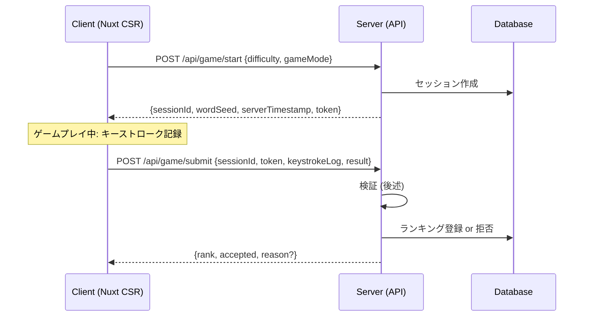

# ランキングシステム スコア改ざん対策設計

## 前提

- ゲームはフロントエンド(CSR)で動作し、クライアントのコードは原理的に改変可能
- 完全な防止は不可能だが、**改ざんコストを十分に高くする**ことが目的
- バックエンドでスコアをDBに保存しランキングを提供する

---

## アーキテクチャ概要



---

## 設計の柱（5層防御）

### 1. サーバー発行セッショントークン

**目的**: ゲーム開始を経ずにスコアだけ送り込むことを防止

| 項目 | 内容 |
|------|------|
| 発行タイミング | ゲーム開始時に `POST /api/game/start` |
| トークン内容 | `sessionId`, `difficulty`, `gameMode`, `wordSeed`, `startedAt` をJWT/HMACで署名 |
| 有効期限 | `startedAt` + 制限時間 + バッファ(30秒、`/start`・`/submit` 双方の往復遅延やD1書き込みレイテンシを吸収) |
| ワンタイム | 1セッション = 1回のみsubmit可。使用済みセッションIDはDB側でフラグ管理 |

```
// サーバー側 payload 例
{
  sessionId: "uuid-v4",
  difficulty: "normal",
  gameMode: "normal",
  wordSeed: 123456,        // 単語出題順を決定する乱数シード
  startedAt: 1719648000000, // Unix ms
  hmac: "sha256(payload + SERVER_SECRET)"
}
```

### 2. キーストロークログの送信とサーバー側リプレイ検証

**目的**: クライアントが申告するスコアではなく、操作ログからサーバーがスコアを再計算

#### クライアントが記録するデータ

```typescript
interface KeystrokeEvent {
  /** ゲーム開始からの経過時間 (ms) */
  t: number
  /** 押されたキー */
  k: string
  /** 単語インデックス (何問目か) */
  w: number
}
```

#### サーバー側検証フロー

1. **セッションの有効性確認** — トークン署名検証、有効期限、未使用チェック
2. **単語列の再構築** — `wordSeed` から出題単語リストを再現（同一ロジックをサーバーにも実装）
3. **キーストローク再生** — ログを順に再生し、正解/ミス/コンボ/スコアをサーバー側で計算
4. **スコア一致確認** — サーバー計算スコア ≒ クライアント申告スコア（±許容誤差）
5. **合格ならDBに登録**

### 3. 統計的異常検知（物理限界チェック）

人間のタイピング速度には物理的上限がある。以下を超えるものは即リジェクト:

| 指標 | 閾値 | 根拠 |
|------|------|------|
| KPS (keys/sec) | > 15 | 世界トップタイパーで約12-14 kps |
| 正確率 + KPS | 100% かつ > 12 kps | 非現実的な組み合わせ |
| 最短ゲーム時間 | < (制限時間 - 1秒) | tick精度による僅かな誤差を許容 |
| キーストローク間隔（単発） | < 10ms | 人間では単発でも起こり得ない超短間隔（スクリプト/貼り付け等） |
| キーストローク間隔（比率） | 30ms未満の間隔が全体の15%超 | 隣接キー同時押し等の単発ミスは許容しつつ、持続的な高速打鍵パターンを検出 |
| 等間隔打鍵 | 標準偏差 < 5ms | ボットの特徴 |

### 4. レートリミット & クールダウン

| ルール | 値 |
|--------|-----|
| 同一ユーザーのゲーム開始頻度 | 最大 10回/10分 |
| スコア送信間隔 | 最低 30秒 (制限時間の半分以上は経過しているはず) |
| 同一IPからのsubmit | 最大 30回/時 |

### 5. データ整合性チェック（クロスバリデーション）

サーバーが検証する整合性ルール:

```
✓ totalKeystrokes == keystrokeLog.length
✓ correctKeystrokes + missCount == totalKeystrokes
✓ playTime ≒ (最後のキーストローク.t - 最初のキーストローク.t) / 1000
✓ wordsCompleted == キーストロークログから再計算した完了単語数
✓ score == サーバー再計算スコア
✓ elapsed ≒ serverNow - session.startedAt (±ネットワーク遅延許容)
```

---

## API設計

### `POST /api/game/start`

**Request:**
```json
{
  "difficulty": "normal",
  "gameMode": "normal"
}
```

**Response:**
```json
{
  "sessionId": "550e8400-e29b-41d4-a716-446655440000",
  "wordSeed": 742918,
  "token": "eyJhbGciOiJIUzI1NiJ9...",
  "serverTime": 1719648000000
}
```

### `POST /api/game/submit`

**Request:**
```json
{
  "sessionId": "550e8400-e29b-41d4-a716-446655440000",
  "token": "eyJhbGciOiJIUzI1NiJ9...",
  "result": {
    "score": 245,
    "totalKeystrokes": 312,
    "correctKeystrokes": 298,
    "missCount": 14,
    "maxCombo": 8,
    "wordsCompleted": 15,
    "playTime": 58.2
  },
  "keystrokeLog": [
    {"t": 1200, "k": "s", "w": 0},
    {"t": 1280, "k": "u", "w": 0},
    ...
  ]
}
```

**Response (成功):**
```json
{
  "accepted": true,
  "rank": 42,
  "serverScore": 245
}
```

**Response (拒否):**
```json
{
  "accepted": false,
  "reason": "SCORE_MISMATCH"
}
```

### `GET /api/ranking?difficulty=normal&limit=100`

**Response:**
```json
{
  "rankings": [
    {
      "rank": 1,
      "playerName": "xxx",
      "score": 520,
      "kps": 8.2,
      "accuracy": 97,
      "difficulty": "normal",
      "playedAt": "2026-06-29T10:00:00Z"
    }
  ]
}
```

---

## 単語列のシード制御

改ざん対策の要。クライアントとサーバーで同じ単語列を生成する:

```typescript
// shared/wordShuffle.ts (クライアント・サーバー共有)
import { WORDS, type Word } from '~/data/words'

/**
 * シードから決定論的に単語列を生成する Mulberry32 PRNG
 */
function mulberry32(seed: number) {
  return function() {
    seed |= 0; seed = seed + 0x6D2B79F5 | 0
    let t = Math.imul(seed ^ seed >>> 15, 1 | seed)
    t = t + Math.imul(t ^ t >>> 7, 61 | t) ^ t
    return ((t ^ t >>> 14) >>> 0) / 4294967296
  }
}

export function generateWordSequence(
  seed: number,
  difficulty: 'easy' | 'normal' | 'hard',
  maxWords: number = 50
): Word[] {
  const diffFilter: Record<string, (1 | 2 | 3)[]> = {
    easy: [1], normal: [1, 2], hard: [1, 2, 3]
  }
  const pool = WORDS.filter(w => diffFilter[difficulty].includes(w.difficulty))
  const rng = mulberry32(seed)
  const result: Word[] = []

  for (let i = 0; i < maxWords; i++) {
    const idx = Math.floor(rng() * pool.length)
    result.push(pool[idx])
  }
  return result
}
```

クライアントはサーバーから受け取った `wordSeed` でゲームの出題順を決定。  
サーバーは同じシードで再構築し、キーストロークログの整合性を確認。

---

## DB スキーマ (Cloudflare D1 / SQLite)

> D1はSQLite互換のため、PostgreSQL的な `UUID` / `TIMESTAMPTZ` / `BOOLEAN` / `gen_random_uuid()` 等の型・関数は使用不可。
> `id` はアプリ側 (Workers) で `crypto.randomUUID()` により生成しTEXTとして挿入する。日時は取り回しやすい `INTEGER` (Unixミリ秒) で保持する。
> 実装済みの [db.ts](../typing_backend/src/db.ts) のスキーマと同一の方針。

```sql
CREATE TABLE IF NOT EXISTS game_sessions (
  id          TEXT    PRIMARY KEY,                     -- crypto.randomUUID() で生成
  difficulty  TEXT    NOT NULL CHECK(difficulty IN ('easy', 'normal', 'hard')),
  game_mode   TEXT    NOT NULL CHECK(game_mode  IN ('normal', 'ra-na')),
  word_seed   INTEGER NOT NULL,
  token_hash  TEXT    NOT NULL,                         -- トークンのSHA256ハッシュ
  started_at  INTEGER NOT NULL,                         -- Unixミリ秒
  submitted   INTEGER NOT NULL DEFAULT 0,                -- BOOLEANの代わりに0/1
  ip_address  TEXT,
  created_at  INTEGER NOT NULL DEFAULT (unixepoch() * 1000)
);

CREATE TABLE IF NOT EXISTS rankings (
  id                  TEXT    PRIMARY KEY,               -- crypto.randomUUID() で生成
  session_id          TEXT    NOT NULL UNIQUE REFERENCES game_sessions(id),
  player_name         TEXT    NOT NULL DEFAULT 'anonymous',
  score               INTEGER NOT NULL,
  play_time           REAL    NOT NULL,
  total_keystrokes    INTEGER NOT NULL,
  correct_keystrokes  INTEGER NOT NULL,
  miss_count          INTEGER NOT NULL,
  accuracy            REAL    NOT NULL,
  kps                 REAL    NOT NULL,
  max_combo           INTEGER NOT NULL,
  words_completed     INTEGER NOT NULL,
  difficulty          TEXT    NOT NULL,
  game_mode           TEXT    NOT NULL,
  verified            INTEGER NOT NULL DEFAULT 1,        -- BOOLEANの代わりに0/1、サーバー検証通過フラグ
  played_at           TEXT    NOT NULL,                   -- ISO8601文字列
  created_at          INTEGER NOT NULL DEFAULT (unixepoch() * 1000)
);

CREATE INDEX IF NOT EXISTS idx_rankings_score ON rankings(difficulty, game_mode, score DESC);
CREATE INDEX IF NOT EXISTS idx_sessions_created ON game_sessions(created_at);
```

---

## セキュリティ考慮事項

### やっても意味が薄い対策（参考）

| 対策 | 理由 |
|------|------|
| クライアント側の難読化/obfuscation | リバースエンジニアリングで突破可能。コスト上昇には貢献 |
| WASM化 | 解析が難しくなるが本質的には同じ |
| クライアント側HMAC | 鍵がクライアントにある限り突破可能 |

### 効果が高い対策（本設計で採用）

| 対策 | 効果 |
|------|------|
| サーバー側リプレイ検証 | ★★★ キーストロークをでっち上げるコストが極めて高い |
| 統計的異常検知 | ★★★ 物理限界を超えるスコアを自動排除 |
| セッショントークン | ★★ ゲーム開始なしのsubmitを防止 |
| ワンタイムセッション | ★★ リプレイ攻撃を防止 |
| レートリミット | ★ 自動化攻撃のコスト増大 |

### 残存リスクと対応

| リスク | 対応 |
|--------|------|
| 完璧なボット（人間同等のタイミングでログ生成） | 管理者によるリプレイ確認機能の提供 |
| 遅延送信による時間詐称 | サーバー時刻とセッション開始時刻の差を検証 |
| 複数アカウント | IPベースのレートリミット、要件次第でCAPTCHA |

---

## 実装優先度

| 優先度 | 対策 | 工数目安 |
|--------|------|----------|
| P0 (必須) | セッショントークン + ワンタイム | 小 |
| P0 (必須) | サーバー側スコア再計算 | 中 |
| P1 (推奨) | キーストロークログ送信 + リプレイ検証 | 中〜大 |
| P1 (推奨) | 統計的異常検知 | 小 |
| P2 (任意) | レートリミット | 小 |
| P2 (任意) | 管理者用リプレイビューア | 大 |

---

## クライアント側の変更概要

### stores/game.ts への追加

```typescript
// ゲーム開始時
async startGame() {
  const { sessionId, wordSeed, token } = await $fetch('/api/game/start', {
    method: 'POST',
    body: { difficulty: this.difficulty, gameMode: this.gameMode }
  })
  this.sessionId = sessionId
  this.sessionToken = token
  this.wordSeed = wordSeed
  this.keystrokeLog = []
  // wordSeed から出題順を生成
  this.wordSequence = generateWordSequence(wordSeed, this.difficulty)
  this.wordIndex = 0
  // ... 既存の初期化処理
}

// onKeyPress 内に追記
this.keystrokeLog.push({ t: Date.now() - this.gameStartTime, k: key, w: this.wordIndex })

// ゲーム終了時
async endGame() {
  // ... 既存処理
  await $fetch('/api/game/submit', {
    method: 'POST',
    body: {
      sessionId: this.sessionId,
      token: this.sessionToken,
      result: this.lastRecord,
      keystrokeLog: this.keystrokeLog
    }
  })
}
```

---

## まとめ

**核心思想**: クライアントを信用せず、サーバーが「ゲームの再現」によりスコアを独自に算出する。  
クライアントの申告スコアはあくまで「参考値」であり、ランキングに登録されるのはサーバーが検証・再計算したスコアのみ。